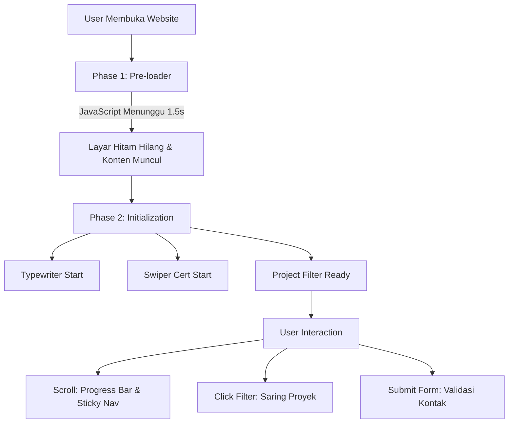

# 📘 Documentation: Portfolio Logic & Workflow

Dokumentasi ini dibuat untuk membantu **Project Manager** dan **Junior Developer** memahami struktur, desain, dan logika di balik website Portfolio Neobrutalist ini.

---

## 🏗️ 1. Core Architecture (The "Building Blocks")

Website ini dibangun menggunakan **"The Big Three"** teknologi web tanpa framework tambahan (Vanilla Stack) untuk performa maksimal dan kontrol penuh.

| Komponen | File | Peran |
| :--- | :--- | :--- |
| **Structure** | `index.html` | Kerangka dasar, teks, dan organisasi konten. |
| **Aesthetics** | `style.css` | Desain Neobrutalism, warna, tipografi, dan tata letak (Layout). |
| **Intelligence** | `script.js` | Interaktivitas, animasi, filtrasi proyek, dan alur logika. |

---

## 🌊 2. Logic Flow (Step-by-Step)

Berikut adalah urutan logika yang terjadi dari saat user mengetik URL hingga berinteraksi dengan website:

---

## ⚡ 3. Key Technical Features Explained

### A. Pre-loader (Branding & UX)
*   **Logika**: Memberikan kesan pertama yang kuat. JavaScript mengunci layar dengan div `#loader` dan menghilangkannya setelah 1,5 detik menggunakan `setTimeout`.
*   **Manfaat PM**: Meningkatkan *brand awareness* sebelum user melihat konten utama.

### B. Project Filtering (Data Management)
*   **Logika**: Setiap kartu proyek memiliki atribut `data-category` (misal: "ml", "da"). Saat tombol filter diklik, JavaScript membandingkan kategori tombol dengan kategori kartu.
*   **Aksi**: Kartu yang tidak cocok akan diberi gaya `display: none`, sementara yang cocok akan ditampilkan dengan animasi `opacity`.
*   **Manfaat PM**: Memudahkan user (recruiter) menemukan skill spesifik yang mereka cari tanpa harus scroll manual.

### C. Scroll Spy & Progress Bar
*   **Logika**: JavaScript memantau posisi scroll user (`window.scrollY`). 
    *   **Progress Bar**: Menghitung persentase (scroll saat ini / total tinggi halaman).
    *   **Active Link**: Menandai menu navigasi (misal: "Projects") saat user berada di area tersebut.

### D. Neobrutalist Design System (CSS)
*   **Warna**: Menggunakan variabel CSS (`:root`) untuk memudahkan perubahan tema warna di masa depan.
*   **Shadows**: Menggunakan "Hard Shadows" (8px 8px 0px #000) yang merupakan ciri khas desain Neobrutalism untuk kesan berani dan modern.

---

## 🛠️ 4. Maintenance Guide (How to Update)

### Menambah Proyek Baru:
1.  Buka `index.html`.
2.  Copy salah satu blok `
`.
3.  Ubah `data-category` sesuai jenisnya (ml/da/ds).
4.  Ganti gambar di folder `assets/images/` dan update link `src`.

### Menambah Sertifikat:
1.  Cari bagian `.swiper-wrapper` di `index.html`.
2.  Tambah blok `
` baru.
3.  JavaScript akan otomatis mendeteksi slide baru dan memasukkannya ke dalam komidi putar (Swiper).

---

## 💡 5. UI/UX Principles Applied
1.  **Hierarchy**: Judul besar dan kontras tinggi memastikan user tahu apa yang paling penting.
2.  **Feedback**: Setiap tombol memiliki efek `hover` (tombol seolah tertekan) untuk memberikan kepuasan taktil secara visual.
3.  **Readability**: Penggunaan font *Space Grotesk* yang bersih namun unik untuk menjaga keterbacaan di layar kecil.

---

> [!TIP]
> **Pro Tip for PM:** Website ini sangat ringan karena tidak menggunakan library berat. Skor SEO akan tinggi karena struktur HTML5 yang semantik.
